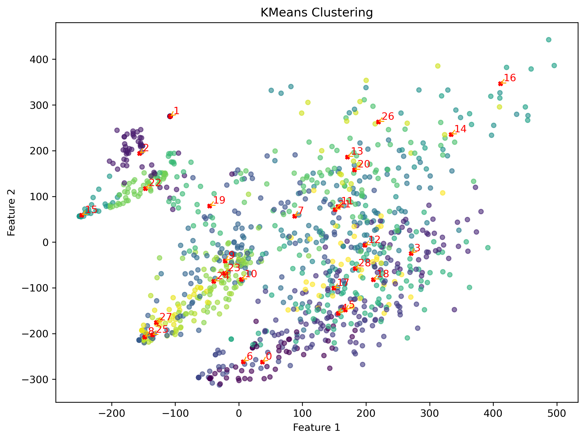
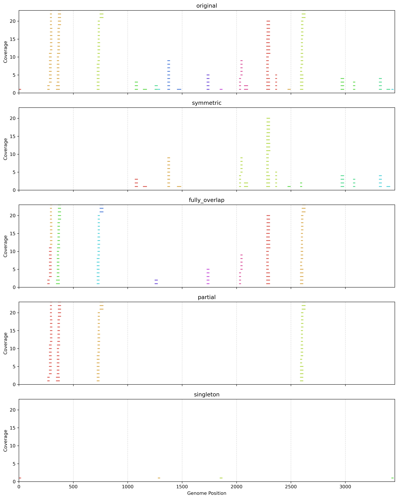
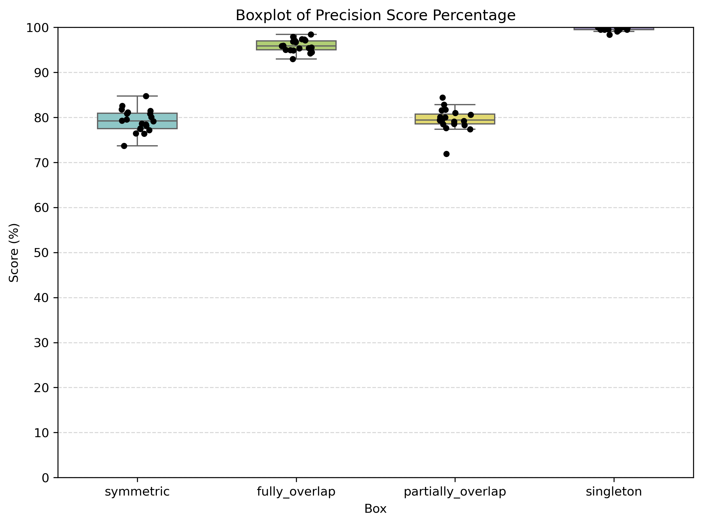

# MetaSRNA Pipeline

## About

MetaSRNA is a unified computational toolkit designed specifically for exploratory small RNA analysis in prokaryotic and microbiome systems.   
It covers the following processes:preprocessing, extraction, mapping to genomes and miRNA databases, quantification, prediction, integration, \
clustering and simulation.

If interested, \
in addition to the instructions below, you may also refer to: https://github.com/Eilenechou/metaSRNA_manuscripts for the preliminary analysis code associated with the Figures and Tables in this paper.

## Requirements

- Linux system  
- Standard UNIX tools (gzip, awk, sed, etc.)  
- conda and mamba or (conda)
- ~100GB RAM (more for large datasets)  

## Installation

### Step 1: Download metaSRNA from Github
```sh
git clone git@github.com:yao-laboratory/metaSRNA.git
```
### Step 2: Install conda environment
option 1: with the provided install_all.sh script (for all processes: main processes and addtional processes in metaSRNA), note: if not add name, the conda env called metasrna_all
```sh
chmod +x install_all.sh
./install_all.sh
conda activate install_all
```
option 2: with the provided install_main.sh script (for main processes in metaSRNA),
note: if not add name, the conda env default called metasrna_main.
```sh
chmod +x install_main.sh
./install_main.sh
conda activate install_main
```
## Prepare the needed input data
   
   *You need this section only when you haven't downloaded the necessary input of this tool,
   below use SRR684065 as example.*

   (1) Download fastq.gz file from NCBI.
   
   Use fastq-dump command (install SRAtoolkit, version:2.11):
   ```sh
   fastq-dump SRR684065 --split-files –gzip  
   ```

   Or download directly from the NCBI website (not recommended).
   
   (2) Download fna and gtf files from NCBI, or if you wanna use same study we tested, visit here: https://doi.org/10.5281/zenodo.17643841

   use wget:
   ```sh
   wget https://ftp.ncbi.nlm.nih.gov/genomes/all/GCF/000/005/845/GCF_000005845.2_ASM584v2/GCF_000005845.2_ASM584v2_genomic.fna.gz    
   gunzip GCF_000005845.2_ASM584v2_genomic.fna.gz
   ```
   ```sh
   wget https://ftp.ncbi.nlm.nih.gov/genomes/all/GCF/000/005/845/GCF_000005845.2_ASM584v2/GCF_000005845.2_ASM584v2_genomic.gtf.gz
   gunzip GCF_000005845.2_ASM584v2_genomic.gtf.gz
   ```

   (3) Download micro RNA database, https://www.mirbase.org/download/, already provide for you in: https://doi.org/10.5281/zenodo.17643841
   ```
   wget https://www.mirbase.org/download/hairpin.fa
   ```
   (4) Optional: This step only for species_detect step. When you samples' species reference are unknown, prepare your own prokaryote database.

   4.1 Zenodo Download:

    link: https://doi.org/10.5281/zenodo.17643841, folder name : prokaryote_database
    
   4.2 NCBI download

    link: https://ftp.ncbi.nlm.nih.gov/blast/db/ 
   
   dowload ref_prok_rep_genome 00~20, or 00~24(newest version). After unzipping, the files are already in BLAST database format. Just place all of them in one folder.

---


# Pipeline Overview
## Command Overview
Analyses are performed using the main script `main.sh` with modules specified by `-p <program>`.

Usage:
```sh
 ./<path to main.sh>/main.sh -p <program> [options]
```
Command overview are performed using the main script `main.sh` with modules specified by `-h`.

Usage:
```sh
 ./<path to main.sh>/main.sh -h
```
main.sh help script: (partial, truncated for readability)
```
Running main assembly process in the folder ...
Usage: ./main.sh -p <program> [options]

Programs and their Required Options:
  preprocess
    - Preprocess the raw input files.
    - Options:
      -r <raw_data>                       Path(Paths) to the raw data file(files, more than one file, paths use space to seperate)
      -w <preprocess functions>           Two way to choose: "merge": merge two fastq file as one fastq file; "unzip": unzip fastq.gz file to fastq file
      -o <output_folder>                  Output folder including (fastq file as extract input)
      
  extract
  ...
  ```

## Diagram Overview 


## Example Overview:
Note: all shells provided below also in this git folder: release_version/Demo
## Run Pipeline End-to-End
Integration Command:

The **integration command** (`-p all`) runs **Step 1 through Step 9** of the pipeline  
(**excluding Step 2, which is optional**). This command processes the raw FASTQ input and generates the final integrated outputs in a single run.

#### Example command

```sh
./main.sh -p all -r <your_fastq_folder>/<fastq_name>.fastq -l 12 -F <tag>  -n <bacteria_name> --t1 2 --t2 4 --umi 2 --pq 100 --pp 100 --sl 18 --ll 40 --fna <your_fna_input_folder>/<fna_file_name>.fna  --gtf <your_gtf_input_folder>/<gtf_file_name>.gtf --hairpin <your_hairpin_input_folder>/hairpin.fa -o <your_output_folder>/all_steps
```
#### Example Shell
Using sample **SRR18745680** as an example, we provide shell scirpt for you.

[integration_command.sh](release_version/Demo/integration_command.sh)

---


### Different Running Cases with examples:
### (1) Single Known Reference Genome

Using sample **SRR18745680** as an example, we provide three ready-to-use shell scripts depending on how you prefer to run the pipeline.

#### **A. Integration Command (Main Steps in One Run)**
Runs the main workflow using the `-p all` integration command.

[single_known_reference_main_steps_integration_command.sh](release_version/Demo/single_known_reference_main_steps_integration_command.sh)

---

#### **B. Main Steps Executed Step-by-Step**
Runs only the main steps individually.  
Use this when you want to execute **selected steps**, or customize the main workflow.

[single_known_reference_main_steps.sh](release_version/Demo/single_known_reference_main_steps.sh)

---

#### **C. Full Workflow: All Available Steps**
Runs **all** pipeline steps (including optional steps).  
Use this when you want to explore or customize the complete workflow.

[single_known_reference_all_steps.sh](release_version/Demo/single_known_reference_all_steps.sh)

---

### (2) Species unknown in a community (need species identification)
In the script, you only need to decide how many species you wanna detect, change **species_number** in the script. 
Using sample **SRR18078867** as an example, we provide two ready-to-use shell scripts depending on how you prefer to run the pipeline.

#### **A. Main Steps Executed Step-by-Step**
Runs only the main steps individually.

[species_unknown_main_steps.sh](release_version/Demo/species_unknown_main_steps.sh)

---

#### **B. Full Workflow: All Available Steps**
Runs **all** pipeline steps (including optional ones).  
Use this when you want to explore or customize the complete workflow.

[species_unknown_all_steps.sh](release_version/Demo/species_unknown_all_steps.sh)

---


### (3) Multiple known reference genomes
Before running script, you need to provide the combined multiple reference genomes as combined.fna and combined.gtf.
Using sample **SRR684065** as an example. we provide three ready-to-use shell scripts depending on how you prefer to run the pipeline.

#### **A. Integration Command (Main Steps in One Run)**
Runs the main workflow using the `-p all` integration command.

[multiple_known_reference_main_steps_integration_command.sh](release_version/Demo/multiple_known_reference_main_steps_integration_command.sh)

---

#### **B. Main Steps Executed Step-by-Step**
Runs only the main steps individually.  
Use this when you want to execute **selected steps**, or customize the main workflow.

[multiple_known_reference_main_steps.sh](release_version/Demo/multiple_known_reference_main_steps.sh)

---

#### **C. Full Workflow: All Available Steps**
Runs **all** pipeline steps (including optional ones).  
Use this when you want to explore or customize the complete workflow.

[multiple_known_reference_all_steps.sh](release_version/Demo/multiple_known_reference_all_steps.sh)

---


### (4) pair-wise fastqs preprocess

Using sample **SRR3382456** as an example. we provide ready-to-use shell script for make SRR3382456_1.fastq and SRR3382456_2.fastq 
can merge as single fastq: SRR3382456.fastq 

#### **Preprocess Steps shell**
[multiple_known_reference_main_steps_integration_command.sh](release_version/Demo/multiple_known_reference_main_steps_integration_command.sh)

Then after preprocessing, the pair-wise fastqs can use above (1) or (2) or (3) any script to do the futher operations.

---

## Run Pipeline Step-by-Step:
### Integration command : `all`

#### Description
Run full pipeline (extract → produce_final_form, except advanced steps).

#### Options

| option | description |
|--------|-------------|
| `-r <file>` | Raw data. |
| `-l <int>` | Minimum length. |
| `-F <pattern>` | Cleaning pattern. |
| `-n <name>` | Database name. |
| `--t1 <int>` | Fault tolerance bits. |
| `--t2 <int>` | Tail tolerance bits. |
| `--umi <flag>` | UMI flag. |
| `--pq <int>` | Query coverage threshold. |
| `--pp <int>` | Percent identity threshold. |
| `--sl <int>` | Minimum sequence length (default 18). |
| `--ll <int>` | Maximum sequence length (default 40). |
| `--fna <file>` | Reference fna. |
| `--gtf <file>` | gtf file. |
| `--hairpin <file>` | miRNA hairpin fa reference. |
| `-o <dir>` | Output folder. |
#### Example usage

```sh
./main.sh -p all -r <your_fastq_folder>/<fastq_name>.fastq -l 12 -F *AACTGTAGGCACCATCAATXXXXXXXXXXXXAGATCGGAAGAGCACACGTCT*  -n ${bacteria} --t1 2 --t2 4 --umi 2 --pq 100 --pp 100 --sl 18 --ll 40 --fna <your_fna_input_folder>/<fna_file_name>.fna  --gtf <your_gtf_input_folder>/<gtf_file_name>.gtf --hairpin <your_hairpin_input_folder>/hairpin.fa -o <your_output_folder>/all_steps
```
---

### Step 0 (Optional): `preprocess` 

#### Description
Preprocess raw FASTQ input files.

#### Input
- Raw FASTQ pair files or FASTQ.gz file.

#### Output
- input FASTQ file for later steps.

#### Options

| option | description |
|--------|-------------|
| `-r <raw_data>` | Paths to raw data files (space-separated). |
| `-w <function>` | `"merge"` (merge paired FASTQ) or `"unzip"` (decompress fastq.gz). |
| `-o <dir>` | Output folder. |
#### Examples
(*ouput folder is <your_output_folder>/pre_process*)
##### Example use 1: -w merge:


Use BBMerge from the BBTools suite designed to merge paired-end sequencing reads into single, longer reads when they overlap. In this examplem, Paired-end FASTQ files <pair1_name>.fastq and <pair2_name>.fastq will become one fastq file with merged reads.

(*output is pair.fastq)

```sh
./main.sh -p preprocess -w merge -r <your_pair_fastqs_folder>/<pair1_name>.fastq,<your_pair_fastqs_folder>/<pair2_name>.fastq -o <your_output_folder>/pre_process
```
##### Example use 2: -w unzip:

A FASTQ file compressed with gzip is decompressing it back into a plain .fastq text file so other steps can read it directly.

(*output is <data_name>.fastq, you can use toy data SRR684065.fastq.gz to try first)

```sh
./main.sh -p preprocess -w unzip -r <your_fastq_gz_folder>/<data_name>.fastq.gz -o <your_output_folder>/pre_process
```
---

### Step 1 : `extract`

#### Description
Extract and filter reads from raw input.

#### Input
- Raw FASTQ from Step 0

#### Output
- Cleaned FASTA (if have umi, also includes UMI file)

#### Options

| option | description |
|--------|-------------|
| `-r <raw_data>` | Path to raw data file. |
| `-l <int>` | Minimum length filter.Remove very short reads: (<l length reads will be removed). |
| `-o <dir>` | Output folder. |
| `-F <pattern>` | Flexible cleaning pattern (use `clean` to skip cleaning). |
| `--t1 <int>` | Fault tolerance number (t1 bases allowed in the pattern that are not correct). |
| `--t2 <int>` | Tail incomplete number (t2 incomplete bases are allowed in the pattern tail).|
| `--umi <flag>` | 0 = no UMI, n = UMI exists in nth part. |
#### Examples
(*ouput folder is <your_output_folder>/extract*)
##### Example use 1
1.1
with adapter and UMI in the middle. and adapter is the standard internal 3’ adapter (or fixed bases sequence) followed by 12 nucleotide UMI sequence, then followed by external 3’ adapter sequenceor (or fixed bases sequence).

Here, Adapter: AACTGTAGGCACCATCAATXXXXXXXXXXXXAGATCGGAAGAGCACACGTCT; t1: 2 of mismatches are tolerated in the adapter match; t2: 4 incomplete bases at the adapter tail can be tolerated; umi=2, means umi in second part: 12 nucleotide UMI (XXXXXXXXXXXX).

(*output files are final_seq_12.fasta/fa/fastq, and final_umi.fasta/fastq)
```sh
./main.sh -p extract -r <your_fastq_folder>/<fastq_name>.fastq -o <your_output_folder>/extract -l 12 -F *AACTGTAGGCACCATCAATXXXXXXXXXXXXAGATCGGAAGAGCACACGTCT* --t1 2 --t2 4 --umi 2
```
##### Example use 2
1.2
with adapter and UMI in the front, called UMI/4N method.adapter is the 4 nucleotide UMI sequence followed by some bases (* means no length and specific bases required), then 4 nucleotide UMI sequence again, then the standard  3’ adapter (or fixed bases sequence).

Here, Adapter: XXXX*XXXXTGGAATTCTCGGGTGCCAAGGAACTCCA*; t1: 2 of mismatches are tolerated in the adapter match; t2: 4 incomplete bases at the adapter tail can be tolerated; umi=1, means means umi in second part: 4 nucleotide UMI (XXXX*XXXX).Final umi file, each umi will combine to 8 bases.

(*output files are final_seq_12.fasta/fa/fastq, and final_umi.fasta/fastq)

```sh
./main.sh -p extract -r <your_fastq_folder>/<fastq_name>.fastq -o <your_output_folder>/extract -l 12 -F XXXX*XXXXTGGAATTCTCGGGTGCCAAGGAACTCCA* --t1 2 --t2 4 --umi 1
```
##### Example use 3
Without umi, but have adapters. Extract step searches for adapter motifs and trims them. If the data contains adapters, leaving adapters in will confuse downstream mapping/quantification steps.

Here, Adapter: AGATCGGAAGAGCACACGTCT; t1: 2 of mismatches are tolerated in the adapter match; t2: 4 incomplete bases at the adapter tail can be tolerated; umi=0, means no umi.

(*output files are final_seq_12.fasta/fa/fastq)

```sh
./main.sh -p extract -r <your_fastq_folder>/<fastq_name>.fastq -o <your_output_folder>/extract -l 12 -F *AGATCGGAAGAGCACACGTCT* --t1 2 --t2 4 --umi 0
```
##### Example use 4
clean data, it skips adapter cleaning (raw reads assumed clean).

(*output files are final_seq_12.fasta/fa/fastq)

```sh
./main.sh -p extract -r <your_fastq_folder>/<fastq_name>.fastq -o <your_output_folder>/extract -l 12 -F clean
```
---

### Step 2 (Optional): 
#### Step 2.1: `detect_species`

#### Description
Detect top-N mapping species.

#### Input
- Clean FASTA file (output in `extract` step).

#### Output
- Generated the top-N abundant species information and detailed abundance report.

#### Options

| option | description |
|--------|-------------|
| `-c <file>` | Clean FASTA file. |
| `-t <int>` | Retain top N species. |
| `-d <dir>` | Path to prokaryote database. |
| `-o <dir>` | Output folder. |

#### Example usage
Detect species step is aligned (BLAST) against the RefProk reference database (prokaryotic genomes),each hit corresponds to a potential species match, then based on mapping counts, the pipeline selects the top-N abundant species.

output files:
- **`mapping.csv`** - includes top nth species'sacc (sequence ID in RefProk) and gcf (NCBI GCF number).
- **`refprok_species_classification_analysis.csv`** - contains a detailed abundance report for all mapped species, first 10 lines are the top 10 sepcies' information, with taxonomy IDs, counts, names, and percentages and etc.(you also can use for other numbers)

(*ouput folder is <your_output_folder>/detect_species*)
##### Example use 1
It shows top 10 species detecting results:

```sh
./main.sh -p detect_species -c <your_output_folder>/extract/final_seq_12.fasta -d <prokaryote_database_folder> -o <your_output_folder>/detect_species -t 10 
```
---

#### Step 2.2:  `detect_species_additional_step`

#### Description
Download top species references and combine into a single database.

#### Input
- Mapping CSV from `detect_species`.

#### Output
- `combined.fna`, `combined.gtf`.

#### Options

| option | description |
|--------|-------------|
| `-c <file>` | Mapping CSV.(output in detect_species step) |
| `--cn <list>` | Comma-separated GCF numbers. |
| `--of <dir>` | Output folder for FNA database. |
| `--og <dir>` | Output folder for GTF database. |
| `--og <dir>` | Output folder. |
| `-n <name>` | combined fna/gtf name. |

#### Example usage
##### Example use 1
Download the top 10 species references produced in the detect_species step, combine them into combined.fna and combined.gtf files, place the .fna file in the FNA database folder, the .gtf file in the GTF database folder, and copy both files to the output folder.

(*output are <your_combined_dataset_name>.fna,<your_combined_dataset_name>.gtf, ouput folder is <your_output_folder>/detect_species_addtional_step*)

```sh
./main.sh -p detect_species_additional_step -c <your_output_folder>/detect_species/mapping.csv -o <your_output_folder>/detect_species_addtional_step --of <your_fna_input_folder>/<fna_file_name>.fna --og <your_output_folder>/<gtf_file_name>.gtf -n <your_combined_dataset_name>
```
---

### Step 3 : `map_genome`

#### Description
Map reads against reference genome.

#### Input
- Clean FASTA (output in extract step) and reference FNA (download or output in detect_species_addtional_step if needs detect species).

#### Output
- Filtered score results: blast_score.txt and blast_score_filter.txt columns are with order: `qseqid` `sacc` `sstart` `send` `evalue` `bitscore` `qcovhsp` `pident`, and analysis result: percentage mapping analysis.

#### Options

| option | description |
|--------|-------------|
| `-f <fna>` | Reference genome FNA (path)  |
| `-c <file>` | Clean FASTA file. |
| `-d <db>` | Indexed local database path. |
| `-n <name>` | Database name. |
| `--pq <int>` | Minimum query coverage per HSP. |
| `--pp <int>` | Minimum percentage identity. |
| `-o <dir>` | Output folder. |
#### Example usage
output files:
- **`blast_score.txt`** - Raw BLAST results containing the following fields:qseqid, sacc, sstart, send, evalue, bitscore, qcovhsp, pident. Sequences use qseqid to identify and may have multiple hits. 
- **`blast_score_filter.txt`** - Filtered BLAST results where both minimum query coverage per HSP (qcovhsp) and minimum percentage identity (pident) thresholds are satisfied. 
- **`genome_mapping_analysis.csv`** – Species-level summary reporting the number of mapped sequences and their relative percentages, calculated against the total number of cleaned sequences in `final_seq_12.fa`.

(ouput folder is <your_output_folder>/detect_species_addtional_step)
##### Example use 1

```sh
./main.sh -p map_genome -f <your_fna_input_folder>/<fna_file_name>.fna -c <your_output_folder>/extract/final_seq_12.fa -d <your_output_folder>/map_genome/<genome_reference_database_name> -n <genome_reference_database_name> --pq 100 --pp 100 -o <your_output_folder>/map_genome
```
---

### Step 4 : `quantify_genome`

#### Description
Quantify mapped genome reads.

#### Input
- GTF file, mapping filter file, UMI file(optional).

#### Output
- Quantified csvs (output_unique_biotype.csv, output_unique_gene_biotype.csv, output_unique_gene.csv).

#### Options

| option | description |
|--------|-------------|
| `-g <gtf>` | GTF file. (path)|
| `-m <file>` | Mapping filter file. |
| `-u <file>` | UMI file. (output in extract step)|
| `-o <dir>` | Output folder. |
#### Example usage
- output files:
  - **`output_unique_biotype.csv`** – summary of unique sequence counts, (UMI counts if choose umi option) grouped by biotype.  
  - **`output_unique_gene_biotype.csv`** – summary grouped by gene and biotype.  
  - **`output_unique_gene.csv`** – summary grouped by gene only.  
##### Example use 1
If input fastq does not have umi:
```sh
./main.sh -p quantify_genome -g <your_gtf_input_folder>/<gtf_file_name>.gtf -m <your_output_folder>/map_genome/blast_score_filter.txt -u none -o <your_output_folder>/quantify_genome
```
##### Example use 2
If input fastq has umi:
```sh
./main.sh -p quantify_genome -g <your_gtf_input_folder>/<gtf_file_name>.gtf -m <your_output_folder>/map_genome/blast_score_filter.txt -u <your_output_folder>/extract/final_umi.fastq  -o <your_output_folder>/quantify_genome
```
---

### Step 5 : `map_mirna`

#### Description
Map reads to reference miRNAs(hairpin.fa).

#### Input
- Clean fasta and miRBase hairpin database reference.

#### Output
- Filtered mirna mapping scores and percentage analysis.

#### Options

| option | description |
|--------|-------------|
| `-f <file>` | Hairpin reference. (we provided hairpin.fa)|
| `-c <file>` | Clean fasta file. (output in extract step)|
| `-d <db>` | Indexed local hairpin database path |
| `-n <name>` | Database name. |
| `-o <dir>` | Output folder. |
#### Example usage
output files:
- **`blastn_hairpin_rna.txt`** – raw hairpin mapping BLAST results containing the following fields: `qseqid` `sseqid` `stitle` `pident` `length` `mismatch` `gapopen` `qstart` `qend` `sstart` `send` `evalue` `bitscore`. 
- **`blastn_hairpin_sequences.csv`** – unique sequences which being mapped above the threshold.  
- **`hairpinrna_analysis.csv`** – includes <small><code>unique_sacc_number</code></small>: number of unique hairpin ID.<small><code>total_sequences_number(after_clean)</code></small>: total number of cleaned sequences used for mapping.  <small><code>percentage</code></small>: proportion of mapped sequences relative to the total cleaned sequences.<small><code>file_name</code></small>: name of the input FASTA file analyzed.

##### Example use 1
Use output Clean FASTA(.fa) file in extract step to map hairpin database:
```sh
./main.sh -p map_mirna -f <your_hairpin_input_folder>/hairpin.fa -c <your_output_folder>/extract/final_seq_12.fa -d <your_output_folder>/map_mirna/hairpin_database -n <your_haiprin_database_name>  -o <your_output_folder>/map_mirna
```
---

### Step 6 : `quantify_mirna`

#### Description
Quantify mapped miRNA reads.

#### Input
- Mapping miRNA filter file and UMI file(optional).

#### Output
- MiRNA quantified csvs.

#### Options

| option | description |
|--------|-------------|
| `-m <file>` | Mapping filter file. |
| `-u <file>` | UMI file (optional). |
| `-o <dir>` | Output folder. |
#### Example usage
output files:
- **`output_unique_biotype_mirna.csv`** – Summary of unique sequence counts, (UMI counts if choose umi option) grouped by biotype.  
##### Example use 1
If input fastq does not have umi:
```sh
./main.sh -p quantify_mirna  -m <your_output_folder>/map_mirna/blastn_hairpin_rna.txt -u none -o <your_output_folder>/quantify_mirna
```
##### Example use 2
If input fastq has umi:
```sh
./main.sh -p quantify_mirna  -m <your_output_folder>/map_mirna/blastn_hairpin_rna.txt -u <your_output_folder>/extract/final_umi.fastq -o <your_output_folder>/quantify_mirna
```
---

### Step 7 : `integrate`

#### Description
Integrate species and miRNA mapping results.

#### Input
- Clean FASTA, species results, miRNA results, UMI file.

#### Output
- Overlap analysis CSV.

#### Options

| option | description |
|--------|-------------|
| `-c <file>` | Clean FASTA. |
| `-s <file>` | Species mapping file. |
| `-m <file>` | miRNA mapping file. |
| `-u <file>` | UMI file.(optional) |
| `--sl <int>` | Minimum sequence length (default 18). |
| `--ll <int>` | Maximum sequence length (default 40). |
| `-o <dir>` | Output folder. |
#### Example usage
output files:
- **`blast_score_prediction_filter.txt`** – Filtered species mapping information containing only the sequences mapped to miRNA hairpin database.
- **`prediction_temp_input.fasta`** – Only keep sequences mapped to both species and miRNAs, but still have duplicated sequences.
- **`prediction_input.fasta`** – Generated by removing duplicated sequences from prediction_temp_input.fasta.
- **`mirna_and_top_species_analysis.csv`** – <small><code>overlap-count</code></small> : number of sequences mapped to both miRNA and species.<small><code>left-microRNA-count</code></small> : number of sequences mapped only to miRNAs.<small><code>right-species-count</code></small> : number of sequences mapped only to species.
<small><code>file_name</code></small> – species mapping files paths.

- **`redundant_sequences_information.csv`** – Detailed report about integration sequences. <small><code>sequence</code></small> : sequences mapped to both species and miRNAs.<small><code>representative_id</code></small> : keep one qseqid as the representative qseqid. <small><code>qseqid_count</code></small> : number of identical sequence qseqids.
<small><code>same_seq_ids</code></small> : list of identical sequence qseqid.<small><code>umi_count</code></small>: number of UMIs in each unique sequence(if have umi).

##### Example use 1
If input fastq does not have umi:
```sh
./main.sh -p integrate -c <your_output_folder>/extract/final_seq_12.fastq -s <your_output_folder>/map_genome -m <your_output_folder>/map_mirna -u none -o <your_output_folder>/integrate
```
##### Example use 2
If input fastq has umi:
```sh
./main.sh -p integrate -c <your_output_folder>/extract/final_seq_12.fastq -s <your_output_folder>/map_genome -m <your_output_folder>/map_mirna -u <your_output_folder>/extract/final_umi.fastq -o <your_output_folder>/integrate
```
---

### Step 8 : `predict mirdeep2` & `predict linearfold`

#### Description
Run predictive models.

#### Input
- Clean fasta, mapping filter score, reference fna.

#### Output
- Predicted structures and candidates.

#### Options

| option | description |
|--------|-------------|
| `-w <model>` | Model: `mirdeep2`, `linearfold`. |
| `-r <file>` | Raw data. |
| `-c <file>` | Clean fasta. |
| `-m <file>` | Mapping filter score file. |
| `-f <fna>` | Reference fna. |
| `-n <name>` | Database name. |
| `-o <dir>` | Output folder. |
#### Step 8.1: `predict mirdeep2` 
output files: (all the files from mirdeep2 tool)
- **`result_<date>.csv/html`** – the csv and HTML outputs show that the miRDeep2 tool identified novel miRNAs from the deep sequencing data.
- **`mirdeep_runs/../output.mrd`** – output.mrd file shows miRBase miRNAs in data that were not scored by miRDeep2. Our metaSRNA in produce_final_form step will still count them in mirdeep2 results.
##### Example use (mirdeep2)
```sh
./main.sh -p predict -w mirdeep2 -c <your_output_folder>/integrate/prediction_input.fasta  -f <your_fna_input_folder>/<fna_file_name>.fna -o <your_output_folder>/predict_mirdeep -n database
```
#### Step 8.2: `predict linearfold` 
We used the LinearFold tool to determine whether our miRNA sequences, extended by 40 bases on both the left and right sides, form a hairpin loop structure.
- **`hairpin_information.csv`** – <small><code>qseqid</code></small> : unique sequence id from genome mapping results. <small><code>id</code></small> : unique seqeunce id from linearfold prediction results. <small><code>start</code></small> : hairpin loop start postion. <small><code>end</code></small> : hairpin loop end postion. <small><code>dis</code></small> : distance between the sequece and its' predicted hairpin loop.<small><code>structure</code></small> : predicted hairpin loop structure.
<small><code>score</code></small> : hairpin loop score. <small><code>length</code></small> : sequence length <small><code>sequence</code></small> : real sequence.

##### Example use (linearfold)
```sh
./main.sh -p predict -w linearfold  -c <your_output_folder>/integrate/prediction_input.fasta -m <your_output_folder>/integrate/blast_score_prediction_filter.txt   -f <your_fna_input_folder>/<fna_file_name>.fna -o <your_output_folder>/predict_linearfold
```
---

### Step 9 : `produce_final_form`

#### Description
Integrate species and miRNA datasets' mapping results and produce the final output tables.

#### Input
- clean FASTA file, reference genome fna file, miRNA mapping results,genome mapping filter results, Duplicate sequences information, miRDeep2 prediction results folder,
LinearFold prediction results file.

#### Output
- Final sequence information and summary tables.

#### Options

| option | description |
|--------|-------------|
| `-c <file>` | Clean FASTA file (after filtering length and removing duplicates) |
| `-f <file>` | Reference genome in .fna format (from NCBI RefSeq/GenBank) |
| `--mi <file>` | miRNA mapping score file |
| `--mg <file>` | Genome mapping filter score file |
| `--inf <file>` | Duplicate sequences information file |
| `--mr <dir>` | miRDeep2 prediction results folder |
| `--lf <file>` | LinearFold prediction results file |
| `-o <dir>` | Output folder |

#### Example usage
We combined the species reference mapping results, miRBase mapping results, and the prediction outputs from miRDeep2 and LinearFold into a single integrated table.

output files:
- **`final_form.csv`** – <small><code>sequence</code></small> : unique sequence from species refernce mapping results. <small><code>mirBase</code></small> : If this sequence can be mapped to miRBase, value is 1; otherwise, value is 0. <small><code>linearfold</code></small> : If this sequence predicted as miRNA by using linearfold tool, value is 1; otherwise, value is 0.<small><code>mirdeep2</code></small> : If this sequence predicted as miRNA by using mirdeep2 tool, value is 1; otherwise, value is 0. <small><code>representative_id</code></small> : pick one qseqid among the same sequences' qseqids.<small><code>qseqid_count</code></small> : The total count of the same sequencesqseqids.<small><code>same_seq_ids</code></small> : The sequences’ qseqids that share this same sequence together. <small><code>umi_count</code></small> : those qseqids for same sequences share how many umi if have umi.

- **`ID_mapping_names_table.csv`** – <small><code>SACC_refseqID</code></small> : Reference sequence accession ID (SACC) from the genome database. <small><code>name</code></small> : Species or organism name associated with the reference sequence<code>internal_ID</code></small> : Unique internal identifier assigned to each reference sequence (numbered 1, 2, 3, ...).

- **`summary_statistics_table.csv`** – <small><code>sequence</code></small> : Unique sequence from mapping results. <small><code>percentage(%)</code></small> : Mapping percentage to each species (pipe-separated if multiple species). <small><code>species_count</code></small> : Number of distinct species this sequence maps to. <small><code>internal_ID</code></small> : Internal species IDs this sequence maps to (pipe-separated if multiple species, corresponds to internal_ID in ID_mapping_names_table.csv).

##### Example use

```sh
./main.sh -p produce_final_form -c <your_output_folder>/integrate/prediction_input.fasta -f <your_fna_input_folder>/<fna_file_name>.fna --mi <your_output_folder>/map_mirna/blastn_hairpin_sequences.csv --mg <your_output_folder>/map_genome/blast_score_filter.txt --inf <your_output_folder>/integrate/redundant_sequences_information.csv --mr <your_output_folder>/predict_mirdeep --lf <your_output_folder>/predict_linearfold/hairpin_information.csv -o <your_output_folder>/produce_final_form
```
---

### Step 10 (Optional):  `additional_step`

Classify and group sequences into genomic blocks based on their mapping positions, overlap patterns, and sequence similarity. This step analyzes spatial relationships between mapped sequences and categorizes them into different block types for downstream analysis.

#### Input
- Final form CSV file (output from `produce_final_form` step)
- Genome mapping file with gene annotations (from `quantify_genome` step)

#### Output
- Classified sequence blocks with detailed spatial information and mapping patterns.

#### Options

| option | description |
|--------|-------------|
| `-f <file>` | Final form file (from produce_final_form step). |
| `-m <file>` | Genome mapping file with gene annotations. |
| `--sl <int>` | Minimum block length threshold (default: 18 bp) |
| `--ll <int>` | Maximum block length threshold (default: 30 bp) |
| `--sc <int>` | Block sequence count threshold range (default: 1,10). Format: "min,max" where blocks are split into two categories - those with sequence count > min and those with count > max |
| `-o <dir>` | Output folder |

#### Example usage

output files:
- **`representative_sequence_results.csv`** – Representative sequences for each unique sequence group. 
- **`mirdeep2_qseqid_list.csv`** – List of sequence IDs (qseqid) that were predicted as miRNAs by miRDeep2 tool.
- **`sorted_representative_sequence_results.bed`** – BED format file sorted by chromosome and position. 
- **`fully_overlapping_blocks.txt`** – Blocks where all sequences completely overlap with each other in genomic positions.
- **`fully_symmetric_blocks.txt`** – Blocks where sequences show symmetric sequence similarity patterns (≥70% similarity threshold).
- **`partially_overlapping_blocks.txt`** – Blocks where sequences have partial spatial overlaps but don't fully overlap.
- **`singleton_blocks.txt`** – Individual sequences that don't cluster with other sequences.
- **`final_all_blocks_table.csv`** – Comprehensive table containing all classified blocks with detailed information.
- **`final_filtered_blocks_table_{min}_{max}_{threshold}.csv`** – Filtered blocks table containing only blocks meeting specified length and coverage criteria, excluding overlapping non-symmetric blocks.
- **`image_cluster_mapping.txt`** – Mapping file showing which cluster each block visualization image belongs to.
- **`each_image_closest_cluster.csv`** – CSV table mapping each block ID to its assigned cluster ID.
- **`KMeans_plot.png`** – 2D PCA visualization of KMeans clustering results showing how blocks are grouped.
- **`KMeans_plot_with_cluster_ids.png`** – KMeans clustering visualization with cluster ID labels annotated on each point.

- Figure Illustration:
<p align="center">
  <a href="release_version/git_images/kmeans_clusters.png">
    
  </a>
</p>

- **`middle_results/`** – Directory containing intermediate processing files and block visualization images:
  - `binary_plot_{blockID}_{xmin}_{xmax}_{chrom}.png` – Binary visualization of centroid block spatial distribution for every cluster.
  - `temp_plot_{blockID}_{xmin}_{xmax}_{chrom}.png` – Temporary plot files about centroid block spatial distribution for every cluster. 

  - Figures Illustration:

<table align="center">
  <tr>
    <td align="center">
      <br>
      <b>fully overlap block(.png)</b>
    </td>
    <td align="center">
      <br>
      <b>Singleton block(.png)</b>
    </td>
  </tr>
  <tr>
    <td align="center">
      <br>
      <b>symmetric block(.png)</b>
    </td>
    <td align="center">
      <br>
      <b>partial overlap block(.png)</b>
    </td>
  </tr>
</table>

##### Example use
```sh
./main.sh -p additional_step -f <your_output_folder>/produce_final_form/final_form.csv  -m <your_output_folder>/quantify_genome/middle_results/blast_score_filter_add_gene.csv -o <your_output_folder>/additional_step 
```
---

### Step 11 (Optional):  `simulate_blocks`

#### Description
Simulate genome mapping data by randomly selecting and combining sequences from classified block categories. This step performs statistical validation of the block classification algorithm by running multiple simulations and calculating precision/recall metrics across different classification strategies.

#### Input
- Block classification text files from `additional_step` (fully_overlapping_blocks.txt, fully_symmetric_blocks.txt, partially_overlapping_blocks.txt, singleton_blocks.txt)

#### Output
- Simulation about visualization showing spatial distribution of simulated blocks with color-coded clusters or precision and recall performance plots for different classification priority strategies.

#### Options

| option | description |
|--------|-------------|
| `-f <files>` | Input block classification files (semicolon-separated paths). Typically includes: fully_overlapping_blocks.txt; fully_symmetric_blocks.txt; partially_overlapping_blocks.txt; singleton_blocks.txt |
| `-n <int>` | Number of blocks to simulate per run |
| `--sg <int>` | Minimum gap distance (bp) between simulated blocks |
| `--bg <int>` | Maximum gap distance (bp) between simulated blocks |
| `-t <int>` | Number of independent simulation runs to perform |
| `-d <0/1>` | Drawing mode: 0 = produce clustering visualization only (recommended for small datasets with < 200 blocks); 1 = produce precision/recall performance figures only (recommended for large datasets or statistical validation) |
| `-o <dir>` | Output folder |

#### Example usage

output files:
- **`gaps_between_{min}_{max}_simulation_times_{n}_final_blocks_clustering.png`** – Visualization showing spatial distribution of simulated blocks with color-coded clusters. Only generated when `-d 0` (clustering figure mode).

- Figure Illustration:
<p align="center">
  <a href="release_version/git_images/simulation.png">
    
  </a>
</p>

- **`precision_recall_figures`** – Precision and recall performance plots for different classification priority strategies. Only generated when `-d 1` (precision/recall mode).

- Figure Illustration:
<p align="center">
  <a href="release_version/git_images/precision_recall.png">
    
  </a>
</p>

- **`temp_results/`** – Temporary directory containing intermediate simulation results and the original simulated BED file.

##### Example use
Visualization command:
```sh
./main.sh -p simulate_blocks -f "<your_output_folder>/additional_step/fully_overlapping_blocks.txt;<your_output_folder>/additional_step/fully_symmetric_blocks.txt;<your_output_folder>/additional_step/partially_overlapping_blocks.txt;<your_output_folder>/additional_step/singleton_blocks.txt" -n 16 --sg 1 --bg 300  -t 1 -d 0  -o <your_output_folder>/simulate_blocks
```
Precision and recall performance plots:
```sh
./main.sh -p simulate_blocks -f "<your_output_folder>/additional_step/fully_overlapping_blocks.txt;<your_output_folder>/additional_step/fully_symmetric_blocks.txt;<your_output_folder>/additional_step/partially_overlapping_blocks.txt;<your_output_folder>/additional_step/singleton_blocks.txt" -n 100 --sg 1 --bg 300  -t 2 -d 1  -o <your_output_folder>/simulate_blocks
```
---

