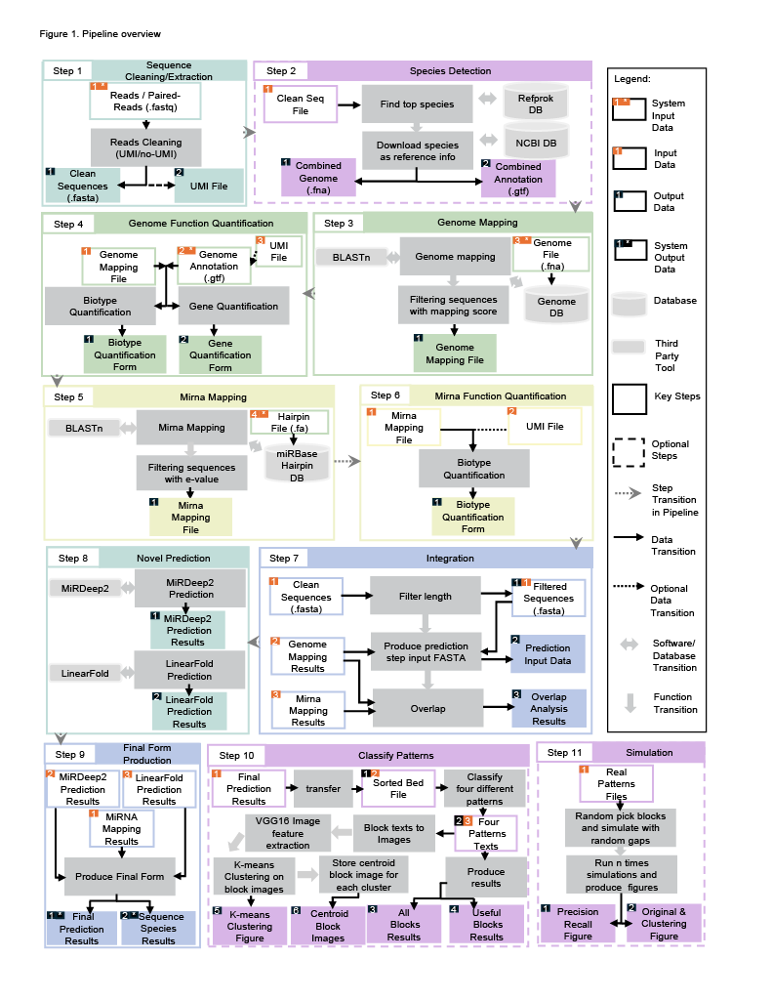

# Meta-sRNA Pipeline

## About

MetaSRNA Pipeline provides an end-to-end solution for processing small RNA (sRNA) and microRNA (miRNA) sequencing data.  
It covers the following processes:
preprocessing, extraction, mapping to genomes and miRNA databases, quantification, prediction, integration, clustering and simulation.

## Requirements

- Linux system  
- Standard UNIX tools (gzip, awk, sed, etc.)  
- conda and mamba or (conda)
- ~100GB RAM (more for large datasets)  

## Installation

### Step 1: Download metaSRNA from Github
```sh
git clone git@github.com:yao-laboratory/metaSRNA.git
```
### Step 2: Install conda environment
option 1: with the provided metasrna_all.sh script (for all processes: main processes and addtional processes in metaSRNA)
```sh
chmod +x metasrna_all.sh
./metasrna_all.sh
conda activate metasrna_all
```
option 2: with the provided metasrna_main.sh script (for main processes in metaSRNA)
```sh
chmod +x metasrna_main.sh
./metasrna_main.sh
conda activate metasrna_main
```

## Pipeline Overview
### Command Overview
Analyses are performed using the main script `main.sh` with modules specified by `-p <program>`.

Usage:
```sh
 ./main.sh -p <program> [options]
```
command overview are performed using the main script `main.sh` with modules specified by `-h`.

Usage:
```sh
 ./main.sh -h
```
### Diagram Overview 



## Prepare the needed input data
   
   *You need this section only when you haven't downloaded the necessary input of this tool,
   below use our toy data: SRR684065 as example.*

   (1) Download fastq.gz file from NCBI.
   
   Use fastq-dump command (install SRAtoolkit, version:2.11):
   ```sh
   fastq-dump SRR684065 --split-files –gzip  
   ```

   Or download directly from the NCBI website (not recommended).
   
   (2) Download fna and gtf files from NCBI, already provide for you in: test_folder/input/genomic.fna,genomic.gtf.

   use wget:
   ```sh
   wget https://ftp.ncbi.nlm.nih.gov/genomes/all/GCF/000/005/845/GCF_000005845.2_ASM584v2/GCF_000005845.2_ASM584v2_genomic.fna.gz    
   gunzip GCF_000005845.2_ASM584v2_genomic.fna.gz
   ```
   ```sh
   wget https://ftp.ncbi.nlm.nih.gov/genomes/all/GCF/000/005/845/GCF_000005845.2_ASM584v2/GCF_000005845.2_ASM584v2_genomic.gtf.gz
   gunzip GCF_000005845.2_ASM584v2_genomic.gtf.gz
   ```

   (3) Download micro RNA database, https://www.mirbase.org/download/, already provide for you in: test_folder/input/haipin.fa.
   ```
   wget https://www.mirbase.org/download/hairpin.fa
   ```
---
### Step 0 : `preprocess`

#### Description
Preprocess raw FASTQ input files.

#### Input
- Raw FASTQ pair files or FASTQ.gz file.

#### Output
- input FASTQ file for later steps.

#### Options

| option | description |
|--------|-------------|
| `-r <raw_data>` | Paths to raw data files (space-separated). |
| `-w <function>` | `"merge"` (merge paired FASTQ) or `"unzip"` (decompress fastq.gz). |
| `-o <dir>` | Output folder. |
#### Examples
(*ouput folder is <your_output_folder>/pre_process*)
##### Example use 1: -w merge:


Use BBMerge from the BBTools suite designed to merge paired-end sequencing reads into single, longer reads when they overlap. In this examplem, Paired-end FASTQ files <pair1_name>.fastq and <pair2_name>.fastq will become one fastq file with merged reads.

(*output is pair.fastq)

```sh
./main.sh -p preprocess -w merge -r <your_pair_fastqs_folder>/<pair1_name>.fastq,<your_pair_fastqs_folder>/<pair2_name>.fastq -o <your_output_folder>/pre_process
```
##### Example use 2: -w unzip:

A FASTQ file compressed with gzip is decompressing it back into a plain .fastq text file so other steps can read it directly.

(*output is <data_name>.fastq, you can use toy data SRR684065.fastq.gz to try first)

```sh
./main.sh -p preprocess -w unzip -r <your_fastq_gz_folder>/<data_name>.fastq.gz -o <your_output_folder>/pre_process
```
---

### Step 1 : `extract`

#### Description
Extract and filter reads from raw input.

#### Input
- Raw FASTQ from Step 0

#### Output
- Cleaned FASTA (if have umi, also includes UMI file)

#### Options

| option | description |
|--------|-------------|
| `-r <raw_data>` | Path to raw data file. |
| `-l <int>` | Minimum length filter.Remove very short reads: (<l length reads will be removed). |
| `-o <dir>` | Output folder. |
| `-F <pattern>` | Flexible cleaning pattern (use `clean` to skip cleaning). |
| `--t1 <int>` | Fault tolerance number (t1 bases allowed in the pattern that are not correct). |
| `--t2 <int>` | Tail incomplete number (t2 incomplete bases are allowed in the pattern tail).|
| `--umi <flag>` | 0 = no UMI, n = UMI exists in nth part. |
#### Examples
(*ouput folder is <your_output_folder>/extract*)
##### Example use 1
1.1
with adapter and UMI in the middle. and adapter is the standard internal 3’ adapter (or fixed bases sequence) followed by 12 nucleotide UMI sequence, then followed by external 3’ adapter sequenceor (or fixed bases sequence).

Here, Adapter: AACTGTAGGCACCATCAATXXXXXXXXXXXXAGATCGGAAGAGCACACGTCT; t1: 2 of mismatches are tolerated in the adapter match; t2: 4 incomplete bases at the adapter tail can be tolerated; umi=2, means umi in second part: 12 nucleotide UMI (XXXXXXXXXXXX).

(*output files are final_seq_12.fasta/fa/fastq, and final_umi.fasta/fastq)
```sh
./main.sh -p extract -r <your_fastq_folder>/<fastq_name>.fastq -o <your_output_folder>/extract -l 12 -F *AACTGTAGGCACCATCAATXXXXXXXXXXXXAGATCGGAAGAGCACACGTCT* --t1 2 --t2 4 --umi 2
```
##### Example use 2
1.2
with adapter and UMI in the front, called UMI/4N method.adapter is the 4 nucleotide UMI sequence followed by some bases (* means no length and specific bases required), then 4 nucleotide UMI sequence again, then the standard  3’ adapter (or fixed bases sequence).

Here, Adapter: XXXX*XXXXTGGAATTCTCGGGTGCCAAGGAACTCCA*; t1: 2 of mismatches are tolerated in the adapter match; t2: 4 incomplete bases at the adapter tail can be tolerated; umi=1, means means umi in second part: 4 nucleotide UMI (XXXX*XXXX).Final umi file, each umi will combine to 8 bases.

(*output files are final_seq_12.fasta/fa/fastq, and final_umi.fasta/fastq)

```sh
./main.sh -p extract -r <your_fastq_folder>/<fastq_name>.fastq -o <your_output_folder>/extract -l 12 -F XXXX*XXXXTGGAATTCTCGGGTGCCAAGGAACTCCA* --t1 2 --t2 4 --umi 1
```
##### Example use 3
Without umi, but have adapters. Extract step searches for adapter motifs and trims them. If the data contains adapters, leaving adapters in will confuse downstream mapping/quantification steps.

Here, Adapter: AGATCGGAAGAGCACACGTCT; t1: 2 of mismatches are tolerated in the adapter match; t2: 4 incomplete bases at the adapter tail can be tolerated; umi=0, means no umi.

(*output files are final_seq_12.fasta/fa/fastq)

```sh
./main.sh -p extract -r <your_fastq_folder>/<fastq_name>.fastq -o <your_output_folder>/extract -l 12 -F *AGATCGGAAGAGCACACGTCT* --t1 2 --t2 4 --umi 0
```
##### Example use 4
clean data, it skips adapter cleaning (raw reads assumed clean).

(*output files are final_seq_12.fasta/fa/fastq)

```sh
./main.sh -p extract -r <your_fastq_folder>/<fastq_name>.fastq -o <your_output_folder>/extract -l 12 -F clean
```
---

### advanced step 1: `detect_species`

#### Description
Detect top-N mapping species.

#### Input
- Clean FASTA file (output in `extract` step).

#### Output
- Generated the top-N abundant species information and detailed abundance report.

#### Options

| option | description |
|--------|-------------|
| `-c <file>` | Clean FASTA file. |
| `-t <int>` | Retain top N species. |
| `-o <dir>` | Output folder. |

#### Example usage
Detect species step is aligned (BLAST) against the RefProk reference database (prokaryotic genomes),each hit corresponds to a potential species match, then based on mapping counts, the pipeline selects the top-N abundant species.

output files:
- **`mapping.csv`** - includes top nth species'sacc (sequence ID in RefProk) and gcf (NCBI GCF number).
- **`refprok_species_classification_analysis.csv`** - contains a detailed abundance report for all mapped species, first 10 lines are the top 10 sepcies' information, with taxonomy IDs, counts, names, and percentages and etc.(you also can use for other numbers)

(*ouput folder is <your_output_folder>/detect_species*)
##### Example use 1
It shows top 10 species detecting results:

```sh
./main.sh -p detect_species -c <your_output_folder>/extract/final_seq_12.fasta -o <your_output_folder>/detect_species -t 10
```
---

### advanced step 2: `detect_species_additional_step`

#### Description
Download top species references and combine into a single database.

#### Input
- Mapping CSV from `detect_species`.

#### Output
- `combined.fna`, `combined.gtf`.

#### Options

| option | description |
|--------|-------------|
| `-c <file>` | Mapping CSV.(output in detect_species step) |
| `--cn <list>` | Comma-separated GCF numbers. |
| `--of <dir>` | Output folder for FNA database. |
| `--og <dir>` | Output folder for GTF database. |
| `--og <dir>` | Output folder. |
| `-n <name>` | combined fna/gtf name. |

#### Example usage
##### Example use 1
Download the top 10 species references produced in the detect_species step, combine them into combined.fna and combined.gtf files, place the .fna file in the FNA database folder, the .gtf file in the GTF database folder, and copy both files to the output folder.

(*output are <your_combined_dataset_name>.fna,<your_combined_dataset_name>.gtf, ouput folder is <your_output_folder>/detect_species_addtional_step*)

```sh
./main.sh -p detect_species_additional_step -c <your_output_folder>/detect_species/mapping.csv -o <your_output_folder>/detect_species_addtional_step --of <your_fna_input_folder>/<fna_file_name>.fna --og <your_output_folder>/<gtf_file_name>.gtf -n <your_combined_dataset_name>
```
---

### Step 2 : `map_genome`

#### Description
Map reads against reference genome.

#### Input
- Clean FASTA (output in extract step) and reference FNA (download or output in detect_species_addtional_step if needs detect species).

#### Output
- Filtered score results: blast_score.txt and blast_score_filter.txt columns are with order: `qseqid` `sacc` `sstart` `send` `evalue` `bitscore` `qcovhsp` `pident`, and analysis result: percentage mapping analysis.

#### Options

| option | description |
|--------|-------------|
| `-f <fna>` | Reference genome FNA (path)  |
| `-c <file>` | Clean FASTA file. |
| `-d <db>` | Indexed local database path. |
| `-n <name>` | Database name. |
| `--pq <int>` | Minimum query coverage per HSP. |
| `--pp <int>` | Minimum percentage identity. |
| `-o <dir>` | Output folder. |
#### Example usage
output files:
- **`blast_score.txt`** - Raw BLAST results containing the following fields:qseqid, sacc, sstart, send, evalue, bitscore, qcovhsp, pident. Sequences use qseqid to identify and may have multiple hits. 
- **`blast_score_filter.txt`** - Filtered BLAST results where both minimum query coverage per HSP (qcovhsp) and minimum percentage identity (pident) thresholds are satisfied. 
- **`genome_mapping_analysis.csv`** – Species-level summary reporting the number of mapped sequences and their relative percentages, calculated against the total number of cleaned sequences in `final_seq_12.fa`.

(ouput folder is <your_output_folder>/detect_species_addtional_step)
##### Example use 1

```sh
./main.sh -p map_genome -f <your_fna_input_folder>/<fna_file_name>.fna -c <your_output_folder>/extract/final_seq_12.fa -d <your_output_folder>/map_genome/<genome_reference_database_name> -n <genome_reference_database_name> --pq 100 --pp 100 -o <your_output_folder>/map_genome
```
---

### Step 3 : `quantify_genome`

#### Description
Quantify mapped genome reads.

#### Input
- GTF file, mapping filter file, UMI file(optional).

#### Output
- Quantified csvs (output_unique_biotype.csv, output_unique_gene_biotype.csv, output_unique_gene.csv).

#### Options

| option | description |
|--------|-------------|
| `-g <gtf>` | GTF file. (path)|
| `-m <file>` | Mapping filter file. |
| `-u <file>` | UMI file. (output in extract step)|
| `-o <dir>` | Output folder. |
#### Example usage
- output files:
  - **`output_unique_biotype.csv`** – summary of unique sequence counts, (UMI counts if choose umi option) grouped by biotype.  
  - **`output_unique_gene_biotype.csv`** – summary grouped by gene and biotype.  
  - **`output_unique_gene.csv`** – summary grouped by gene only.  
##### Example use 1
If input fastq does not have umi:
```sh
./main.sh -p quantify_genome -g <your_gtf_input_folder>/<gtf_file_name>.gtf -m <your_output_folder>/map_genome/blast_score_filter.txt -u none -o <your_output_folder>/quantify_genome
```
##### Example use 2
If input fastq has umi:
```sh
./main.sh -p quantify_genome -g <your_gtf_input_folder>/<gtf_file_name>.gtf -m <your_output_folder>/map_genome/blast_score_filter.txt -u <your_output_folder>/extract/final_umi.fastq  -o <your_output_folder>/quantify_genome
```
---

### Step 4 : `map_mirna`

#### Description
Map reads to reference miRNAs(hairpin.fa).

#### Input
- Clean fasta and miRBase hairpin database reference.

#### Output
- Filtered mirna mapping scores and percentage analysis.

#### Options

| option | description |
|--------|-------------|
| `-f <file>` | Hairpin reference. (we provided hairpin.fa)|
| `-c <file>` | Clean fasta file. (output in extract step)|
| `-d <db>` | Indexed local database path |
| `-n <name>` | Database name. |
| `-o <dir>` | Output folder. |
#### Example usage
output files:
- **`blastn_hairpin_rna.txt`** – raw hairpin mapping BLAST results containing the following fields: `qseqid` `sseqid` `stitle` `pident` `length` `mismatch` `gapopen` `qstart` `qend` `sstart` `send` `evalue` `bitscore`. 
- **`blastn_hairpin_sequences.csv`** – unique sequences which being mapped above the threshold.  
- **`hairpinrna_analysis.csv`** – includes <small><code>unique_sacc_number</code></small>: number of unique hairpin ID.<small><code>total_sequences_number(after_clean)</code></small>: total number of cleaned sequences used for mapping.  <small><code>percentage</code></small>: proportion of mapped sequences relative to the total cleaned sequences.<small><code>file_name</code></small>: name of the input FASTA file analyzed.

##### Example use 1
Use output Clean FASTA(.fa) file in extract step to map hairpin database:
```sh
./main.sh -p map_mirna -f <your_hairpin_input_folder>/hairpin.fa -c <your_output_folder>/extract/final_seq_12.fa -d <your_output_folder>/map_mirna/hairpin_database -n <your_haiprin_database_name>  -o <your_output_folder>/map_mirna
```
---

### Step 5 : `quantify_mirna`

#### Description
Quantify mapped miRNA reads.

#### Input
- Mapping miRNA filter file and UMI file(optional).

#### Output
- MiRNA quantified csvs.

#### Options

| option | description |
|--------|-------------|
| `-m <file>` | Mapping filter file. |
| `-u <file>` | UMI file (optional). |
| `-o <dir>` | Output folder. |
#### Example usage
output files:
- **`output_unique_biotype_mirna.csv`** – Summary of unique sequence counts, (UMI counts if choose umi option) grouped by biotype.  
##### Example use 1
If input fastq does not have umi:
```sh
./main.sh -p quantify_mirna  -m <your_output_folder>/map_mirna/blastn_hairpin_rna.txt -u none -o <your_output_folder>/quantify_mirna
```
##### Example use 2
If input fastq has umi:
```sh
./main.sh -p quantify_mirna  -m <your_output_folder>/map_mirna/blastn_hairpin_rna.txt -u <your_output_folder>/extract/final_umi.fastq -o <your_output_folder>/quantify_mirna
```
---

### Step 6 : `integrate`

#### Description
Integrate species and miRNA mapping results.

#### Input
- Clean FASTA, species results, miRNA results, UMI file.

#### Output
- Overlap analysis CSV.

#### Options

| option | description |
|--------|-------------|
| `-c <file>` | Clean FASTA. |
| `-s <file>` | Species mapping file. |
| `-m <file>` | miRNA mapping file. |
| `-u <file>` | UMI file.(optional) |
| `--sl <int>` | Minimum sequence length (default 18). |
| `--ll <int>` | Maximum sequence length (default 40). |
| `-o <dir>` | Output folder. |
#### Example usage
output files:
- **`blast_score_prediction_filter.txt`** – Filtered species mapping information containing only the sequences mapped to miRNA hairpin database.
- **`prediction_temp_input.fasta`** – Only keep sequences mapped to both species and miRNAs, but still have duplicated sequences.
- **`prediction_input.fasta`** – Generated by removing duplicated sequences from prediction_temp_input.fasta.
- **`mirna_and_top_species_analysis.csv`** – <small><code>overlap-count</code></small> : number of sequences mapped to both miRNA and species.<small><code>left-microRNA-count</code></small> : number of sequences mapped only to miRNAs.<small><code>right-species-count</code></small> : number of sequences mapped only to species.
<small><code>file_name</code></small> – species mapping files paths.

- **`redundant_sequences_information.csv`** – Detailed report about integration sequences. <small><code>sequence</code></small> : sequences mapped to both species and miRNAs.<small><code>representative_id</code></small> : keep one qseqid as the representative qseqid. <small><code>qseqid_count</code></small> : number of identical sequence qseqids.
<small><code>same_seq_ids</code></small> : list of identical sequence qseqid.<small><code>umi_count</code></small>: number of UMIs in each unique sequence(if have umi).

##### Example use 1
If input fastq does not have umi:
```sh
./main.sh -p integrate -c <your_output_folder>/extract/final_seq_12.fastq -s <your_output_folder>/map_genome -m <your_output_folder>/map_mirna -u none -o <your_output_folder>/integrate
```
##### Example use 2
If input fastq has umi:
```sh
./main.sh -p integrate -c <your_output_folder>/extract/final_seq_12.fastq -s <your_output_folder>/map_genome -m <your_output_folder>/map_mirna -u <your_output_folder>/extract/final_umi.fastq -o <your_output_folder>/integrate
```
---

### Step 7 & Step 8 : `predict mirdeep2` & `predict linearfold`

#### Description
Run predictive models.

#### Input
- Clean fasta, mapping filter score, reference fna.

#### Output
- Predicted structures and candidates.

#### Options

| option | description |
|--------|-------------|
| `-w <model>` | Model: `mirdeep2`, `linearfold`. |
| `-r <file>` | Raw data. |
| `-c <file>` | Clean fasta. |
| `-m <file>` | Mapping filter score file. |
| `-f <fna>` | Reference fna. |
| `-n <name>` | Database name. |
| `-o <dir>` | Output folder. |
#### Example usage

```sh
./main.sh -p predict -w mirdeep2 -c <your_output_folder>/integrate/prediction_input.fasta  -f <your_fna_input_folder>/<fna_file_name>.fna -o <your_output_folder>/predict_mirdeep -n database
```

#### Example usage
```sh
./main.sh -p predict -w linearfold  -c <your_output_folder>/integrate/prediction_input.fasta -m <your_output_folder>/integrate/blast_score_prediction_filter.txt   -f <your_fna_input_folder>/<fna_file_name>.fna -o <your_output_folder>/predict_linearfold
```


---

### Step 9 : `produce_final_form`

#### Description
Produce main steps' final output.

#### Input
- Clean FASTA, miRNA mapping, duplicate report, prediction results.

#### Output
- Final sequence information.

#### Options

| option | description |
|--------|-------------|
| `-c <file>` | Clean fasta. |
| `-m <file>` | miRNA mapping score file. |
| `--inf <file>` | Duplicate sequences report. |
| `--mr <dir>` | miRDeep2 results. |
| `--lf <file>` | LinearFold results. |
| `-o <dir>` | Output folder. |
#### Example usage

```sh
./main.sh -p produce_final_form -c <your_output_folder>/integrate/prediction_input.fasta -m <your_output_folder>/map_mirna/blastn_hairpin_sequences.csv --inf <your_output_folder>/integrate/redundant_sequences_information.csv --mr <your_output_folder>/predict_mirdeep --lf <your_output_folder>/predict_linearfold/hairpin_information.csv  -o <your_output_folder>/produce_final_form
```
---

### advanced step 3 : `additional_step`

#### Description
divided sequences to blocks based on their positions from final form.

#### Options

| option | description |
|--------|-------------|
| `-f <file>` | Final form file (from produce_final_form step). |
| `-m <file>` | mapping genome file filtered by score. |
| `--sl <int>` | Minimum block length (default 18). |
| `--ll <int>` | Maximum block length (default 30). |
| `--sc <int>` | Block sequences count threshold 1,n.(default 1,10), means one table from greater than(>) 1, the other greater than n. |
| `-o <dir>` | Output folder. |
#### Example usage

```sh
./main.sh -p additional_step -f <your_output_folder>/produce_final_form/final_form.csv  -m <your_output_folder>/quantify_genome/middle_results/blast_score_filter_add_gene.csv -o <your_output_folder>/additional_step 
```
---

### advanced step 4 : `simulate_blocks`

#### Description
Simulation about genome mapping blocks and visualization.

#### Options

| option | description |
|--------|-------------|
| `-f <files>` | Input files (';' separated). |
| `-n <int>` | Number of blocks. |
| `--sg <int>` | Minimum gap threshold. |
| `--bg <int>` | Maximum gap threshold. |
| `-t <int>` | Simulation times. |
| `-d <0/1>` | Figure mode (0=clustering figure only,for small simulation data, 1=precision/recall,for big simulation data). |
| `-o <dir>` | Output folder. |
#### Example usage

```sh
./main.sh -p simulate_blocks -f "<your_output_folder>/additional_step/fully_overlapping_blocks.txt;<your_output_folder>/additional_step/fully_symmetric_blocks.txt;<your_output_folder>/additional_step/partially_overlapping_blocks.txt;<your_output_folder>/additional_step/singleton_blocks.txt" -n 100 --sg 1 --bg 300  -t 2 -d 1  -o <your_output_folder>/simulate_blocks
```
---

### integration command : `all`

#### Description
Run full pipeline (extract → produce_final_form, except advanced steps).

#### Options

| option | description |
|--------|-------------|
| `-r <file>` | Raw data. |
| `-l <int>` | Minimum length. |
| `-F <pattern>` | Cleaning pattern. |
| `-n <name>` | Database name. |
| `--t1 <int>` | Fault tolerance bits. |
| `--t2 <int>` | Tail tolerance bits. |
| `--umi <flag>` | UMI flag. |
| `--pq <int>` | Query coverage threshold. |
| `--pp <int>` | Percent identity threshold. |
| `--sl <int>` | Minimum sequence length (default 18). |
| `--ll <int>` | Maximum sequence length (default 40). |
| `--fna <file>` | Reference fna. |
| `--gtf <file>` | gtf file. |
| `--hairpin <file>` | miRNA hairpin fa reference. |
| `-o <dir>` | Output folder. |
#### Example usage

```sh
./main.sh -p all -r <your_fastq_folder>/<fastq_name>.fastq -l 12 -F *AACTGTAGGCACCATCAATXXXXXXXXXXXXAGATCGGAAGAGCACACGTCT*  -n ${bacteria} --t1 2 --t2 4 --umi 2 --pq 100 --pp 100 --sl 18 --ll 40 --fna <your_fna_input_folder>/<fna_file_name>.fna  --gtf <your_gtf_input_folder>/<gtf_file_name>.gtf --hairpin <your_hairpin_input_folder>/hairpin.fa -o <your_output_folder>/all_steps
```
---

## Examples

```sh

```

---
to be continued ...